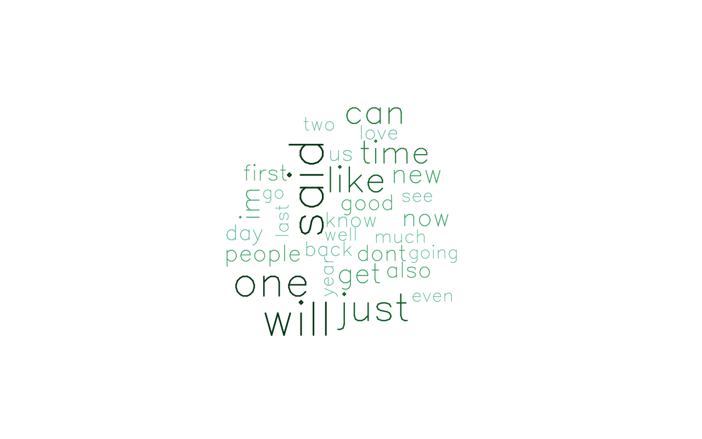

## Introduction
The overal goal of this project is to make a predictive text app to accurately predict the next word of a given a phrase based on an n-gram model that will be trained on three text files containing numerous lines pulled from english blogs, news, and tweets.

This report is an analytical exporation of these files to really understand the data so we can make better decisions on cleaning the data and creating our predicitive model.

The following will be cover in this report:

* Reading in the Data 
* General exploratory analysis
* Interesting observations or items to be cleaned
* General idea of how the predictive model will work

-------------

## Requirements

### Packages

```{r, cache=TRUE, warning=FALSE}
library(tm)
library(caret)
library(SnowballC)
library(RXKCD)
library(RColorBrewer)
library(wordcloud)
library(ggplot2)
```

### Randomization seed

For purposes of tracability and reproducability I set the seed value so any randomized function (example sampling) can be reproduced:

```{r}
set.seed(123)
```

-------------

## Reading in the Data

### Read in English blogs, news, and twitter feeds
This dataset/corpus was provided by Coursera (retreived from: https://d396qusza40orc.cloudfront.net/dsscapstone/dataset/Coursera-SwiftKey.zip)

```{r, cache=TRUE}
blogs <- readLines("./final/en_US/en_US.blogs.txt")
```

```{r, cache=TRUE}
news <- readLines("./final/en_US/en_US.news.txt")
```

```{r, cache=TRUE, warning=FALSE}
tweets <- readLines("./final/en_US/en_US.twitter.txt")
```

-------------

## Exploratory Analysis

#### Line Counts
```{r, cache=TRUE}
summary(blogs)
```
```{r, cache=TRUE}
summary(news)
```
```{r, cache=TRUE, warning=FALSE}
summary(tweets)
```


The original set is quite large so we will take a smaller sample to work with.  I will randomly sample 5,000 lines from each file.

```{r, cache=TRUE, eval=TRUE}
blogs.index <- sample(1:899288, 10000)
blogs.training <- blogs[blogs.index]; rm(blogs.index); rm(blogs)

news.index <- sample(1:1010242, 10000)
news.training <- news[news.index]; rm(news.index); rm(news)

tweets.index <- sample(1:2360148, 10000)
tweets.training <- tweets[tweets.index]; rm(tweets.index); rm(tweets)
```

#### Word Counts

First we will seperate the strings by spaces:
```{r, cache=TRUE, eval=TRUE}
blogs.training.words <- strsplit(blogs.training, ' ')
news.training.words <- strsplit(news.training, ' ')
tweets.training.words <- strsplit(tweets.training, ' ')
```

Then we can write a function to count the words:

```{r, cache=TRUE, eval=TRUE}
word.count <- function(set){
  count = 0
  for (i in 1:10000) {
    count <- count + length(set[[i]])
  }
  count
}
```

Word Counts for our samples:

```{r, cache=TRUE, eval=TRUE}
word.count(blogs.training.words)
word.count(news.training.words)
word.count(tweets.training.words)
```

--------------

## Interesting observations

I combined the samples into one set that we will prep for cleaning:

```{r, cache=TRUE, eval=TRUE}
set <- blogs.training; rm(blogs.training)
set <- rbind(set,news.training); rm(news.training)
set <- rbind(set,tweets.training); rm(tweets.training)

txt <- VectorSource(set); rm(set)
txt.corpus <- Corpus(txt); rm(txt)

txt.corpus <- tm_map(txt.corpus, content_transformer(tolower))
```

### Things to clean:

#### Remove profanities

Profanities add no value to the statement and will just create an unwanted convolution.  I chose to filter using Google's list of bad words:

```{r, cache=TRUE, eval=TRUE}
badwords <- VectorSource(readLines("./badwords"))
txt.corpus <- tm_map(txt.corpus, removeWords, badwords)
```

#### Remove numerics

Numerics are quantitative and therefore will not be worth predicting as they are circumstancial.

```{r, cache=TRUE, eval=TRUE}
txt.corpus <- tm_map(txt.corpus, removeNumbers)
```

#### Remove punctuation (. , ! ? ;)

Punctuation can be used incorrectly, sporadically, or alternatively as expressions (emojicons) which will not be very helpful to our prediction.

```{r, cache=TRUE, eval=TRUE}
txt.corpus <- tm_map(txt.corpus, removePunctuation)
```

#### Remove extra white space:

```{r, cache=TRUE, eval=TRUE}
txt.corpus <- tm_map(txt.corpus, stripWhitespace)
```

#### Remove stop words

Stop words are words like "and" which, instead of adding value to gramatic expression, are more of a division of thought like a punctuation mark.

```{r, cache=TRUE, eval=TRUE}
txt.corpus <- tm_map(txt.corpus, removeWords, stopwords("english"))
```


### Histogram

```{r, cache=TRUE, eval=TRUE}
txt.corpus <- tm_map(txt.corpus, PlainTextDocument)

    dtm <- DocumentTermMatrix(txt.corpus, 
                 control=list(wordLengths=c(1, Inf),
                 bounds=list(global=c(floor(length(txt.corpus)*0.03), Inf))))

dtm <- as.matrix(dtm)
frequency <- colSums(dtm)
frequency <- sort(frequency, decreasing=TRUE)
df <- data.frame(Word = names(frequency), Freq = frequency)

ggplot(df[1:15,], aes(x = reorder(Word, -Freq), Freq)) +
  xlab("Word") + 
  geom_bar(stat="identity")

```

### Word Cloud

```{r, cache=TRUE, eval=TRUE, results="hide"}
pal <- brewer.pal(9, "BuGn")
pal <- pal[-(1:2)]
png("wordcloud1.png", width=1280,height=800)
wordcloud(df$Word,df$Freq, scale=c(8,.3),min.freq=2,max.words=100, random.order=T, rot.per=.15, colors=pal, vfont=c("sans serif","plain"))
dev.off()
```




---------------

## Ideas for Predicition Model

The idea behind the prediction model is that given an input phrase the following steps will be taken to give the top 3 predictions of the next word to come:

1. Break phrase into words
2. Select the last 3 words
3. Match lines for these 3 words and return the next following word
4. Return the top 10 most frequent
5. Repeat steps 2 - 5 using last 2 words and then last word
6. Accumulate the frequencies from step 4 and calculate top 3 most frequent


---------------

## References

1. Starkweather, Jon PhD. "Introduction to basic Text Mining in R." Retrieved from: http://it.unt.edu/benchmarks/issues/2014/01/rss-matters

2. Andrew. "Text Mining the Complete Works of William Shakespeare" Retrieved from: http://www.r-bloggers.com/text-mining-the-complete-works-of-william-shakespeare/

3. "Google's Official List of Bad Words" Retrieved from: http://fffff.at/googles-official-list-of-bad-words/


