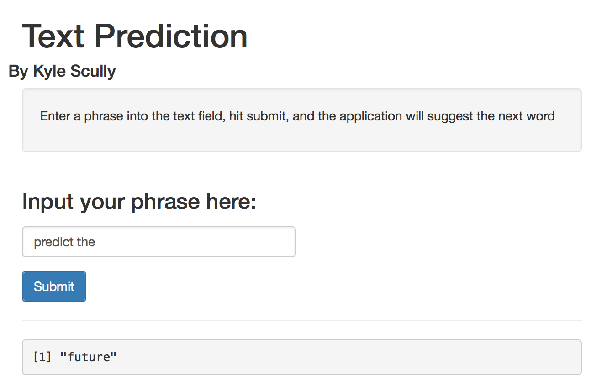

Text Prediction
========================================================
author: Kyle Scully 
One direct application of computational linguistics is text prediction, where based on user input the next word is predicted.

### Where to find:
The application can be cloned from here:
https://github.com/zieka/computational_linguistics

The application is hosted on shinyapps.io:
https://zieka.shinyapps.io/computational_linguistics

The Data
========================================================


* Data is a compilation of text from news, blogs, and tweets retrieved at:  (https://d396qusza40orc.cloudfront.net/dsscapstone/dataset/Coursera-SwiftKey.zip) 

* The Data was cleaned in the following manner

```r
set <- tm_map(set, stripWhitespace)
set <- tm_map(set, content_transformer(tolower))
set <- tm_map(set, removePunctuation)
set <- tm_map(set, removeNumbers)
badWords <- scan("./badwords", "")
set <- tm_map(set, removeWords, badWords)
```


The Front End/ How to use
========================================================



The Back End (N-gram Algorithm)
========================================================
* Before runtime, buildsets.R builds term document matrices for n-grams 2-4 and associated frequency tables.
* An n-gram is essnetially a "window" that masks the text so only n number of words can be seen at a time.
* The tokenizing algothim basically does the following:
    1. Looks at the data through this "window" 
    2. Writes down what it sees into a matrix
    3. Moves the "window" over one word
    4. Repeats

* The end result is a matrix of strings all n number of words long


The Back End (at runtime)
========================================================
* The input text is passed through the same filter as the Data
* The input text is analyzed to determine the n-gram needed.

```r
ngram_needed = number_of_input_words + 1
```
* The associated n-gram frequency is matched with the input:

```r
regex <- paste("^",input_string,sep="")
if(ngram_needed >= 4){
  prediction <- strsplit(quadgram.w[grep(regex,quadgram.w$word),][1]$word, " ")[[1]][4] }
```
* If the most frequent is "NA" it will retry with (n-1)gram


